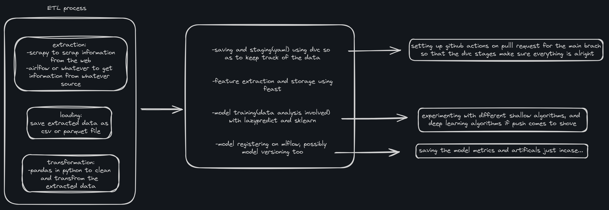

MLOPs practice
***

#### This is my personal project for the month of july

the shoe sales csv files were generated from chatgpt using the prompts:
- generate a csv file containing 10 years worth of records for a shoe sales shop
- include the target gender and the gender that actually bought the shoe, then make a dirty version of the csv file

> NB:  while using the free version of chatgpt the you can only generate the clean version of the data, you'll have to wait for thr next day to generate the dirty version. so choose which one you want first before generating the data

there are two of the datasets
- one clean(delve straight into the work) 
- one dirty(for the purpose of practice)

objectives for this project `19th july 2024`
- [x] import and clean data with pandas
- [x] save dataset with dvc
- [x] create dvc pipeline for running workflow
- [ ] extract features with sklearn
- [ ] save extracted features using feast
- [ ] perform some statistical analysis and plots with pandas and plotly
- [ ] train model using shallow algorithm
- [ ] track and register model with mlflow 
- [ ] build docker file for reproducability

https://mega.nz/folder/kIYSCCiD#Y-ASVhH6JaA5UFhn4800jA